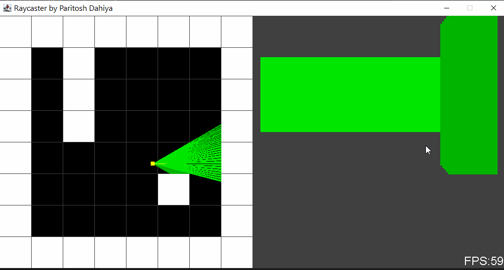
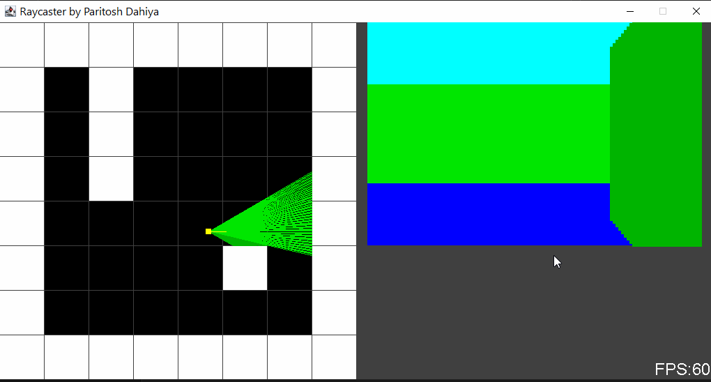

# Java-Raycaster_v1

This is the Java ☕ implementation of the raycaster engine (implemented in C using OpenGL) made by the youtuber 3DSage. I really liked his video and tried to implement it myself.

The raycaster can be run directly from the executable jar file. Use either Arrow keys or WASD keys to move the player.

## Screenshots of Raycaster

Raycaster without ceiling and floor backgrounds  

Raycaster with ceiling and floor backgrounds  

Link to 3DSage's video- <https://www.youtube.com/watch?v=gYRrGTC7GtA>  
Link to 3DSage's Github repository- <https://github.com/3DSage/OpenGL-Raycaster_v1>
